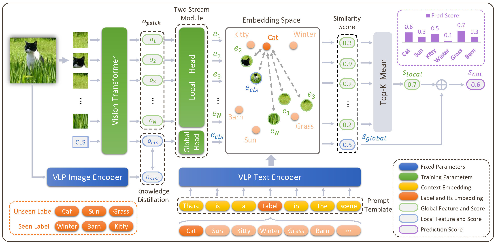

[](https://paperswithcode.com/sota/multi-label-zero-shot-learning-on-nus-wide?p=open-vocabulary-multi-label-classification)
[](https://paperswithcode.com/sota/multi-label-zero-shot-learning-on-open-images?p=open-vocabulary-multi-label-classification)

# Open-Vocabulary Multi-Label Classification via Multi-Modal Knowledge Transfer (AAAI 2023 Oral)



This is the official repository of our paper Open-Vocabulary Multi-Label Classification via Multi-modal Knowledge Transfer.

## Setup

```bash
pip install -r requirements.txt
```

## Preparation

1. Download pretrained VLP(ViT-B/16) model from [OpenAI CLIP](https://github.com/openai/CLIP).

2. Download images of NUS-WIDE dataset  from [NUS-WIDE](https://lms.comp.nus.edu.sg/wp-content/uploads/2019/research/nuswide/NUS-WIDE.html).

3. Download annotations following the [BiAM](https://github.com/akshitac8/BiAM) from [here](https://drive.google.com/drive/folders/1jvJ0FnO_bs3HJeYrEJu7IcuilgBipasA?usp=sharing).

4. Download other files from [here](https://drive.google.com/drive/folders/1kTb83_p92fM04OAkGyiHypOgwtxc4wVa?usp=sharing).

The organization of the dataset directory is shown as follows.

```bash
NUS-WIDE
  ├── features
  ├── Flickr
  ├── Concepts81.txt
  ├── Concepts925.txt
  ├── img_names.pkl
  ├── label_emb.pt
  └── test_img_names.pkl
```

## Training MKT on NUS-WIDE

```bash
python3 train_nus_first_stage.py \
        --data-path path_to_dataset \
        --clip-path path_to_clip_model

```

The checkpoint of the first training stage is [here](https://drive.google.com/file/d/158ntqLvepVklwmY1PvlqIhguv7wN6SZI/view?usp=sharing).

```bash
python3 -m torch.distributed.launch --nproc_per_node=8 train_nus_second_stage.py \
        --data-path path_to_dataset \
        --clip-path path_to_clip_model \
        --ckpt-path path_to_first_stage_ckpt
```

The checkpoint of the second training stage is [here](https://drive.google.com/file/d/1TBh1eWDLhHTjTfnRRfZULpe4DfPj7u9O/view?usp=sharing).

## Testing MKT on NUS-WIDE

```bash
python3 train_nus_second_stage.py --eval \
        --data-path path_to_dataset \
        --clip-path path_to_clip_model \
        --ckpt-path path_to_first_stage_ckpt \
        --eval-ckpt path_to_first_second_ckpt \
```

## Inference on A Single Image

```bash
python3 inference.py \
        --data-path path_to_dataset \
        --clip-path path_to_clip_model \
        --img-ckpt path_to_first_stage_ckpt \
        --txt-ckpt path_to_second_stage_ckpt \
        --image-path figures/test.jpg
```

## Acknowledgement

We would like to thank [BiAM](https://github.com/akshitac8/BiAM) and [timm](https://github.com/rwightman/pytorch-image-models) for the codebase.

## License

MKT is MIT-licensed. The license applies to the pre-trained models as well.

## Citation

Consider cite MKT in your publications if it helps your research.

```bash
@article{he2022open,
  title={Open-Vocabulary Multi-Label Classification via Multi-modal Knowledge Transfer},
  author={He, Sunan and Guo, Taian and Dai, Tao and Qiao, Ruizhi and Ren, Bo and Xia, Shu-Tao},
  journal={arXiv preprint arXiv:2207.01887},
  year={2022}
}
```
